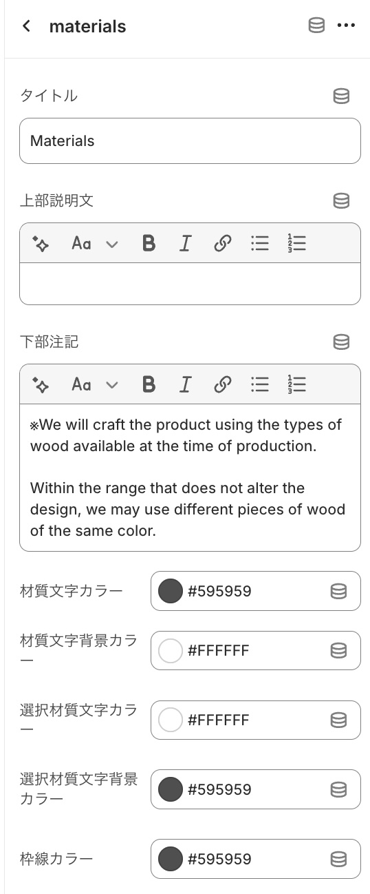

# Shopify Materials Pallet

---

Shopifyで商品の素材、材質情報をパレット一覧で視覚的に分かりやすく表示するデザインです。  
Liquid + CSS + JavaScript でシンプルに実装しています。  
**保守性・運用性を高めるため、カスタムフィールド（メタオブジェクト）の更新のみでデザインが反映される構造**にしています。

---

## 🚀 使用方法

1. `assets/materials.liquid` をテーマに追加  
2. カスタムフィールド（メタオブジェクト）を定義
3. 商品カスタムフィールド（商品メタフィールド）を定義
4. テーマエディタでセクションを追加し、セクション設定を行う

---

## 💻 完成ビューサンプル

完成プレビューサンプルです。
|  |

---

## 🧩 メタオブジェクト構成

### 🪄 materials メタオブジェクト定義

### 📋 materials メタオブジェクトサンプル

---

### 🧩 materials 商品メタフィールド定義

### 📋 materials 商品メタフィールドサンプル

---

### 🗺️ materials テーマエディター内でセクション追加＆設定

---

## 🧑‍💻 作者

**Ryohma U.**  
ポートフォリオ：[https://www.rnsystem.jp](https://www.rnsystem.jp)

---

> 💡 **補足**  
> このコードは教育・学習目的で公開しています。  
> 実運用時は必ずテーマ構成やメタオブジェクト名を各店舗環境に合わせて変更してください。
